# 🗺️ Fleet Crossconnects & Companion Graph

**Interactive Architecture Map**: Click any node in the diagram below to open its GitHub repository.

---

## 1. Interactive Connection Diagram

```mermaid
graph TD
  %% Styles
  classDef cad fill:#1e3a5f,stroke:#38bdf8,stroke-width:2px,color:#fff;
  classDef vr fill:#4c1d95,stroke:#c084fc,stroke-width:2px,color:#fff;
  classDef bot fill:#78350f,stroke:#fbbf24,stroke-width:2px,color:#fff;
  classDef voice fill:#064e3b,stroke:#34d399,stroke-width:2px,color:#fff;
  classDef intel fill:#312e81,stroke:#818cf8,stroke-width:2px,color:#fff;
  classDef media fill:#831843,stroke:#f472b6,stroke-width:2px,color:#fff;

  subgraph CAD_DCC["📐 CAD, CAM & DCC Ecosystem"]
    blender["blender-mcp<br/>(3D DCC / Render)"]:::cad
    qcad["qcad-mcp<br/>(2D DXF / Drafting)"]:::cad
    freecad["freecad-mcp<br/>(Parametric STEP)"]:::cad
    kicad["kicad-mcp<br/>(PCB Layout)"]:::cad
  end

  subgraph VR_SPATIAL["🥽 VR Environments & Worlds"]
    resonite["resonite-mcp<br/>(Resonite VR Link)"]:::vr
    godot["godot-mcp<br/>(Godot Engine)"]:::vr
    worldlabs["worldlabs-mcp<br/>(3D Spatial Worlds)"]:::vr
  end

  subgraph MAKER_ROBOTICS["🤖 Maker & Robotics"]
    yahboom["yahboom-mcp<br/>(Boomy Robot Car)"]:::bot
    teleop["teleoperator-mcp<br/>(Robot Teleop)"]:::bot
  end

  subgraph VOICE_BUS["🎙️ Voice & Soundboard"]
    speech["speech-mcp<br/>(Voice Gateway)"]:::voice
    alexa["alexa-mcp<br/>(Voice Patterns)"]:::voice
    learnbot["learnbot-mcp<br/>(Language Tutor)"]:::voice
    demovid["demo-vid-mcp<br/>(Video Narration)"]:::voice
    homeassistant["home-assistant-mcp<br/>(Smart Home)"]:::voice
  end

  subgraph INTEL_COMMS["📬 Intelligence, Alerts, PR & Comms"]
    aiwatcher["aiwatcher-mcp<br/>(Intel Radar)"]:::intel
    fleetagent["fleet-agent-mcp<br/>(Fritz Coworker)"]:::intel
    fleetpr["fleet-public-relations-mcp<br/>(PR Outreach & Tone Lint)"]:::intel
    discord["discord-mcp<br/>(Discord Bot & Channels)"]:::intel
    admiral["admiral-mcp<br/>(Fleet Dispatcher)"]:::intel
    email["email-mcp<br/>(Email Dispatch)"]:::intel
    comms["comms-mcp<br/>(Omnichannel)"]:::intel
    vienna["vienna-life-assistant<br/>(Concierge)"]:::intel
    arxiv["arxiv-mcp<br/>(Paper Corpus)"]:::intel
    calibre["calibre-mcp<br/>(EBook Library)"]:::intel
  end

  subgraph AUDIO_OPS["🎛️ Audio, Video & Memory"]
    reaper["reaper-mcp<br/>(DAW / Soundboard)"]:::media
    virtualdj["virtualdj-mcp<br/>(DJ Decks)"]:::media
    mixxdj["mixx-dj-mcp<br/>(DJ AV Hub / mixxxxx)"]:::media
    resolume["resolume-mcp<br/>(Resolume Arena / VJ)"]:::media
    davinci["davinci-resolve-mcp<br/>(Video NLE)"]:::media
    osc["osc-mcp<br/>(OSC Protocol)"]:::media
    memory["advanced-memory-mcp<br/>(MemOps Knowledge)"]:::media
  end

  %% CAD Interconnections
  blender <-->|"DXF / SVG 2D-3D"| qcad
  blender <-->|"Parametric STEP"| freecad
  freecad <-->|"3D PCB Enclosure Fit"| kicad
  blender <-->|"Product Render"| kicad

  %% CAD to VR & Robotics
  blender <-->|"GLTF / VRM Avatars"| resonite
  blender <-->|"Scene Sync"| godot
  freecad <-->|"STEP to STL Mounts"| yahboom
  qcad <-->|"Laser-Cut Plates"| yahboom

  %% VR to Robotics (Digital Twin & Teleop)
  yahboom <-->|"OSC Digital Twin Telemetry"| resonite
  teleop <-->|"VR Controller Teleop"| resonite
  teleop <-->|"Motor Motion Stream"| yahboom
  worldlabs -->|"Generated Worlds"| resonite

  %% Voice Integrations
  yahboom -->|"Spoken Boomy Voice"| speech
  teleop -->|"Two-Way Audio"| speech
  fleetagent <-->|"Voice Command Bus"| speech
  alexa -->|"Command Routing"| speech
  learnbot -->|"Pronunciation TTS"| speech
  demovid -->|"Voiceover Track"| speech
  homeassistant -->|"Doorbell Alerts"| speech
  aiwatcher -->|"Breaking News TTS"| speech

  %% Long-Running Task Completion Readouts (Speech)
  blender -.->|"Render Done"| speech
  arxiv -.->|"Corpus Index Done"| speech
  calibre -.->|"RAG Index Done"| speech
  worldlabs -.->|"World Gen Done"| speech

  %% Email & Intelligence
  aiwatcher -->|"Daily Digest"| email
  aiwatcher -->|"Archive"| calibre
  aiwatcher -->|"Ingest Stream"| arxiv
  fleetagent -->|"Incident Alerts"| email
  fleetagent <-->|"Surveil Triage"| aiwatcher
  comms -->|"Dispatch"| email
  vienna -->|"Booking Alerts"| email
  arxiv -->|"Store Paper"| calibre

  %% PR Outreach & Discord
  fleetpr <-->|"Community Thread Surveil / Broadcast"| discord
  fleetpr -->|"Alert Escalation"| admiral
  fleetpr <-->|"Intel Surge"| aiwatcher
  discord <-->|"Fritz Discord Operator"| fleetagent
  discord -->|"Voice TTS Alerts"| speech

  %% Audio & Media
  yahboom -->|"Sound FX"| reaper
  yahboom -->|"Music Decks"| virtualdj
  mixxdj <-->|"NDI Video Stream / OSC Triggers"| resolume
  mixxdj <-->|"Live DJ Feed / Nekomimi Avatar Stage"| resonite
  davinci <-->|"Timeline Sync"| osc
  speech <-->|"Conversational Recall"| memory

  %% Click Directives (Interactive navigation on GitHub)
  click blender "https://github.com/sandraschi/blender-mcp" "Open blender-mcp on GitHub"
  click qcad "https://github.com/sandraschi/qcad-mcp" "Open qcad-mcp on GitHub"
  click freecad "https://github.com/sandraschi/freecad-mcp" "Open freecad-mcp on GitHub"
  click kicad "https://github.com/sandraschi/kicad-mcp" "Open kicad-mcp on GitHub"
  click resonite "https://github.com/sandraschi/resonite-mcp" "Open resonite-mcp on GitHub"
  click godot "https://github.com/sandraschi/godot-mcp" "Open godot-mcp on GitHub"
  click worldlabs "https://github.com/sandraschi/worldlabs-mcp" "Open worldlabs-mcp on GitHub"
  click yahboom "https://github.com/sandraschi/yahboom-mcp" "Open yahboom-mcp on GitHub"
  click teleop "https://github.com/sandraschi/teleoperator-mcp" "Open teleoperator-mcp on GitHub"
  click speech "https://github.com/sandraschi/speech-mcp" "Open speech-mcp on GitHub"
  click alexa "https://github.com/sandraschi/alexa-mcp" "Open alexa-mcp on GitHub"
  click learnbot "https://github.com/sandraschi/learnbot-mcp" "Open learnbot-mcp on GitHub"
  click demovid "https://github.com/sandraschi/demo-vid-mcp" "Open demo-vid-mcp on GitHub"
  click homeassistant "https://github.com/sandraschi/home-assistant-mcp" "Open home-assistant-mcp on GitHub"
  click aiwatcher "https://github.com/sandraschi/aiwatcher-mcp" "Open aiwatcher-mcp on GitHub"
  click fleetagent "https://github.com/sandraschi/fleet-agent-mcp" "Open fleet-agent-mcp on GitHub"
  click fleetpr "https://github.com/sandraschi/fleet-public-relations-mcp" "Open fleet-public-relations-mcp on GitHub"
  click discord "https://github.com/sandraschi/discord-mcp" "Open discord-mcp on GitHub"
  click admiral "https://github.com/sandraschi/admiral-mcp" "Open admiral-mcp on GitHub"
  click email "https://github.com/sandraschi/email-mcp" "Open email-mcp on GitHub"
  click comms "https://github.com/sandraschi/comms-mcp" "Open comms-mcp on GitHub"
  click vienna "https://github.com/sandraschi/vienna-life-assistant" "Open vienna-life-assistant on GitHub"
  click arxiv "https://github.com/sandraschi/arxiv-mcp" "Open arxiv-mcp on GitHub"
  click calibre "https://github.com/sandraschi/calibre-mcp" "Open calibre-mcp on GitHub"
  click reaper "https://github.com/sandraschi/reaper-mcp" "Open reaper-mcp on GitHub"
  click virtualdj "https://github.com/sandraschi/virtualdj-mcp" "Open virtualdj-mcp on GitHub"
  click mixxdj "https://github.com/sandraschi/mixx-dj-mcp" "Open mixx-dj-mcp on GitHub"
  click resolume "https://github.com/sandraschi/resolume-mcp" "Open resolume-mcp on GitHub"
  click davinci "https://github.com/sandraschi/davinci-resolve-mcp" "Open davinci-resolve-mcp on GitHub"
  click osc "https://github.com/sandraschi/osc-mcp" "Open osc-mcp on GitHub"
  click memory "https://github.com/sandraschi/advanced-memory-mcp" "Open advanced-memory-mcp on GitHub"
```

---

## 2. Key Workflow Pipelines

### 📐 CAD & DCC Mesh Pipeline
1. **2D Drafting to 3D Extrusion**: Create mechanical parts or floorplans in `qcad-mcp`, then extrude, bevel, and light them in `blender-mcp`.
2. **Parametric STEP Solids**: Design enclosures in `freecad-mcp` with exact tolerances. Import into `blender-mcp` for photorealistic material rendering.
3. **PCB Fit Verification**: Export 3D board layouts from `kicad-mcp` as STEP files directly into `freecad-mcp` to ensure connectors and standoffs clear physical enclosures.

### 🤖 VR Environments & Robotics (Digital Twin + Teleoperation)
1. **Digital Twin**: `yahboom-mcp` streams real-time sensor telemetry (LIDAR, IMU, ultrasonic) over OSC into `resonite-mcp`. An in-world avatar mirrors the physical robot.
2. **VR Teleoperation**: Put on a VR headset in Resonite and steer the physical robot via `teleoperator-mcp` with two-way audio through `speech-mcp`.
3. **Fabrication Link**: `yahboom-mcp` chassis brackets and sensor mounts are designed in `freecad-mcp` and converted from STEP to 3D printable STL files.

### 🎙️ The Universal Completion Readout Pattern
Any compute-intensive server (`arxiv-mcp`, `calibre-mcp`, `blender-mcp`, `worldlabs-mcp`) hooks optionally into `speech-mcp` to speak:
`"Task <xyz> completed, runtime <n> minutes"`

### 📬 Community Surveillance & Humble Discovery (fleet-public-relations-mcp + discord-mcp)
1. **Listening First**: Instead of cold promotional blasts, `fleet-public-relations-mcp` works alongside `discord-mcp` to monitor community help channels (Mixxx, Blender, ROS, Claude, Cursor) for users struggling with problems our fleet solves.
2. **Rah-Rah Tone Linting**: AI draft engine (`pr_tone_lint`) rejects all hype words ("game changer", "revolutionary", "10x"), ensuring posts read as calm, technical, and genuinely helpful pointers.
3. **Approval-Gated Outreach**: Drafts sit in your local dashboard for manual approval before posting.

### 🎛️ AV Live Staging & Projection Pipeline (mixx-dj-mcp + resolume-mcp + resonite-mcp)
1. **NDI Video Routing to Resolume**: `mixx-dj-mcp` / `mixxxxx` publishes deck video mixes and synced visuals over NDI straight into `resolume-mcp` for projection mapping across gig venues.
2. **Virtual Metaverse Dance Stage**: Stream live audio feeds and OSC BPM tempo clocks into `resonite-mcp` to drive an animated avatar stage (like a 3D Nekomimi dancer reacting in sync with the mix), projecting the virtual world onto venue screens or live streams.

---

## 3. Fleet Crossconnect Architecture Rules
All crossconnects adhere to [`FLEET_CROSSCONNECT_STANDARD.md`](https://github.com/sandraschi/mcp-central-docs/blob/main/standards/FLEET_CROSSCONNECT_STANDARD.md):
- **Rule 1: Standalone by Default**: Every server boots cleanly without requiring companion servers. Crossconnects are optional enhancements.
- **Rule 2: The 1-Hop Contract**: Repositories document and link only their immediate peers. No transitive dependency chasing.
- **Rule 3: Soft Degradation**: Missing companions return friendly installation URLs rather than crashing.
