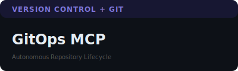

# 📂 MCP Project Catalog

A detailed look at the core Model Context Protocol (MCP) servers in the sandraschi fleet. Every server features a **vibrant webapp sidecar** for human control and real-time telemetry.

---

## 🤖 Robotics & Agents

| [](https://github.com/sandraschi/openclaude-mcp#readme) | [](https://github.com/sandraschi/openmanus-mcp#readme) |
| :--- | :--- |
| **[openclaude-mcp](https://github.com/sandraschi/openclaude-mcp)** | **[openmanus-mcp](https://github.com/sandraschi/openmanus-mcp)** |
| Control plane for the 2026 Claude Code harness. Hardened FastMCP 3.2 infrastructure. | Subprocess runner for OpenManus FOSS agent CLI — open-source agentic AI. |

| [](https://github.com/sandraschi/robofang#readme) | [](https://github.com/sandraschi/yahboom-mcp#readme) |
| :--- | :--- |
| **[robofang](https://github.com/sandraschi/robofang)** | **[yahboom-mcp](https://github.com/sandraschi/yahboom-mcp)** |
| Sovereign orchestration hub. Multi-agent council system, fleet management, and VR bridges. | ROS 2 bridge for Raspberry Pi 5 robotics. Two-brain cognition (Gemma/Claude). |

---

## 🌐 Virtual Worlds & VR

| [](https://github.com/sandraschi/avatar-mcp#readme) | [](https://github.com/sandraschi/osc-mcp#readme) |
| :--- | :--- |
| **[avatar-mcp](https://github.com/sandraschi/avatar-mcp)** | **[osc-mcp](https://github.com/sandraschi/osc-mcp)** |
| Identity and animation control for VRChat and Resonite avatars. | Universal protocol bridge for real-time sensor and controller transport. |

| [](https://github.com/sandraschi/resonite-mcp#readme) | [](https://github.com/sandraschi/unity3d-mcp#readme) |
| :--- | :--- |
| **[resonite-mcp](https://github.com/sandraschi/resonite-mcp)** | **[unity3d-mcp](https://github.com/sandraschi/unity3d-mcp)** |
| Real-time VR integration. Connects Claude to Resonite via ProtoFlux/Websockets. | Virtual robotics and physics simulation lab for training and testing. |

| [](https://github.com/sandraschi/vroidstudio-mcp#readme) | |
| :--- | :--- |
| **[vroidstudio-mcp](https://github.com/sandraschi/vroidstudio-mcp)** | |
| Automated 3D character and asset pipeline for virtual identities. | |

---

## 🎨 Creative Tooling

| [](https://github.com/sandraschi/blender-mcp#readme) | [](https://github.com/sandraschi/davinci-resolve-mcp#readme) |
| :--- | :--- |
| **[blender-mcp](https://github.com/sandraschi/blender-mcp)** | **[davinci-resolve-mcp](https://github.com/sandraschi/davinci-resolve-mcp)** |
| Automated 3D mesh and scene generation via Blender Python API. | Automated post-production and color grading pipeline for video editing. |

| [](https://github.com/sandraschi/gimp-mcp#readme) | [](https://github.com/sandraschi/inkscape-mcp#readme) |
| :--- | :--- |
| **[gimp-mcp](https://github.com/sandraschi/gimp-mcp)** | **[inkscape-mcp](https://github.com/sandraschi/inkscape-mcp)** |
| Automated image processing and texture pipeline for asset creation. | Vector graphics and SVG illustration automation substrate. |

| [](https://github.com/sandraschi/worldlabs-mcp#readme) | |
| :--- | :--- |
| **[worldlabs-mcp](https://github.com/sandraschi/worldlabs-mcp)** | |
| AI-driven world and scene generation for virtual environments. | |

---

## 🧠 Knowledge Engineering

| [](https://github.com/sandraschi/advanced-memory-mcp#readme) | [](https://github.com/sandraschi/arxiv-mcp#readme) |
| :--- | :--- |
| **[advanced-memory-mcp](https://github.com/sandraschi/advanced-memory-mcp)** | **[arxiv-mcp](https://github.com/sandraschi/arxiv-mcp)** |
| Zettelkasten knowledge base with 200+ curated semantic skills and memory. | Scientific paper search and RAG ingestion for academic research. |

| [](https://github.com/sandraschi/calibre-mcp#readme) | |
| :--- | :--- |
| **[calibre-mcp](https://github.com/sandraschi/calibre-mcp)** | |
| Large ebook collection with semantic RAG search and full-text indexing. | |

---

## 🎮 Fun & Games

| [](https://github.com/sandraschi/games-mcp#readme) | [](https://github.com/sandraschi/xkcd-mcp#readme) |
| :--- | :--- |
| **[games-mcp](https://github.com/sandraschi/games-mcp)** | **[xkcd-mcp](https://github.com/sandraschi/xkcd-mcp)** |
| Local entertainment grid management and emulation orchestration. | Comic retrieval and semantic search over the xkcd humor corpus. |

---

## 🏠 Home & Infrastructure

| [](https://github.com/sandraschi/devices-mcp#readme) | [](https://github.com/sandraschi/transit-mcp#readme) |
| :--- | :--- |
| **[devices-mcp](https://github.com/sandraschi/devices-mcp)** | **[transit-mcp](https://github.com/sandraschi/transit-mcp)** |
| Unified interface for Smart Home control and IoT grid management. | Real-time Vienna city transit (Wiener Linien) api integration. |

---

## 🛠️ Dev & Platform

| [](https://github.com/sandraschi/dark-factory-mcp#readme) | [](https://github.com/sandraschi/fileops-mcp#readme) |
| :--- | :--- |
| **[dark-factory-mcp](https://github.com/sandraschi/dark-factory-mcp)** | **[fileops-mcp](https://github.com/sandraschi/fileops-mcp)** |
| Unattended fleet automation plane for industrial-grade operations. | Hardened distributed file management and storage substrate. |

| [](https://github.com/sandraschi/gitops-mcp#readme) | [](https://github.com/sandraschi/meta-mcp#readme) |
| :--- | :--- |
| **[gitops-mcp](https://github.com/sandraschi/gitops-mcp)** | **[meta-mcp](https://github.com/sandraschi/meta-mcp)** |
| Autonomous repository lifecycle and version control orchestration. | Self-aware MCP server management and tool diagnostics. |

---

<details>
<summary><strong>🤓 How do these visual cards work?</strong></summary>

Each card above is a plain `.svg` file sitting in the `assets/` folder. GitHub's Markdown renderer displays inline images natively — so `[](https://github.com/...)` gives you a clickable image that renders as a styled card, with no JavaScript, no external fonts, no CDN, no CSS files, no build step.

The SVG itself carries everything inline:

```xml
<svg width="400" height="120" xmlns="http://www.w3.org/2000/svg">
  <rect width="100%" height="100%" fill="#0d1117" rx="10"/>
  <rect width="100%" height="30" fill="#993556" rx="10" opacity="0.4"/>
  <text x="20" y="20" font-family="sans-serif" font-size="12"
        font-weight="bold" fill="#ED93B1" letter-spacing="1">CATEGORY</text>
  <text x="20" y="75" font-family="sans-serif" font-size="24"
        font-weight="800" fill="#e6edf3">Server Name</text>
  <text x="20" y="100" font-family="sans-serif" font-size="10"
        fill="#555">SHORT DESCRIPTION</text>
</svg>
```

"Where's the CSS?" — it's in the `fill=`, `font-family=`, `font-size=` attributes. SVG has its own presentation model; CSS is optional. The dark background, rounded corners, and coloured header strip are just two `<rect>` elements. The whole card is ~600 bytes.

The grid layout is a Markdown table where each cell contains an image link. GitHub renders the table, the images render inside it, and the links wrap the images. Three nested Markdown features doing exactly what they were designed to do.

</details>

---

*Homespun Fleet · Alsergrund Node · Vienna · 2026*
