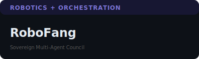
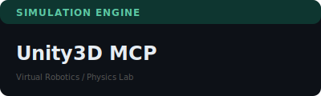
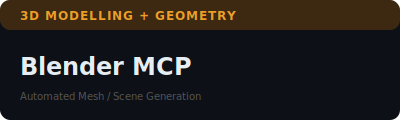
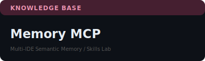

# 📂 MCP Project Catalog

A detailed look at the core Model Context Protocol (MCP) servers in the sandraschi fleet. Every server features a **vibrant webapp sidecar** for human control and real-time telemetry.

---

## 🤖 Robotics & Agents

|  |  |
| :--- | :--- |
| **[openclaude-mcp](https://github.com/sandraschi/openclaude-mcp)** | **[openmanus-mcp](https://github.com/sandraschi/openmanus-mcp)** |
| Control plane for the 2026 Claude Code harness. Hardened FastMCP 3.2 infrastructure. | Subprocess runner for OpenManus FOSS agent CLI — open-source agentic AI. |

|  |  |
| :--- | :--- |
| **[yahboom-mcp](https://github.com/sandraschi/yahboom-mcp)** | **[robofang](https://github.com/sandraschi/robofang)** |
| ROS 2 bridge for Raspberry Pi 5 robotics. Two-brain cognition (Gemma/Claude). | Sovereign orchestration hub. Multi-agent council system and fleet management. |

---

## 🌐 Virtual Worlds & VR

|  |  |
| :--- | :--- |
| **[resonite-mcp](https://github.com/sandraschi/resonite-mcp)** | **[unity3d-mcp](https://github.com/sandraschi/unity3d-mcp)** |
| Real-time VR integration. Connects Claude to Resonite via ProtoFlux/Websockets. | Virtual robotics and physics simulation lab for training and testing. |

|  |  |
| :--- | :--- |
| **[osc-mcp](https://github.com/sandraschi/osc-mcp)** | **[avatar-mcp](https://github.com/sandraschi/avatar-mcp)** |
| Universal protocol bridge for real-time sensor and controller transport. | Identity and animation control for VRChat and Resonite avatars. |

---

## 🎨 Creative Tooling

|  |  |
| :--- | :--- |
| **[blender-mcp](https://github.com/sandraschi/blender-mcp)** | **[gimp-mcp](https://github.com/sandraschi/gimp-mcp)** |
| Automated 3D mesh and scene generation via Blender Python API. | Automated image processing and texture pipeline for asset creation. |

|  | |
| :--- | :--- |
| **[inkscape-mcp](https://github.com/sandraschi/inkscape-mcp)** | |
| Vector graphics and SVG illustration automation substrate. | |

---

## 📚 Knowledge & Media

|  |  |
| :--- | :--- |
| **[calibre-mcp](https://github.com/sandraschi/calibre-mcp)** | **[plex-mcp](https://github.com/sandraschi/plex-mcp)** |
| Large ebook collection with semantic RAG search and full-text indexing. | Automated media library discovery and management for Plex servers. |

|  |  |
| :--- | :--- |
| **[advanced-memory-mcp](https://github.com/sandraschi/advanced-memory-mcp)** | **[devices-mcp](https://github.com/sandraschi/devices-mcp)** |
| Zettelkasten knowledge base with 200+ curated semantic skills and memory. | Unified interface for Smart Home control and IoT grid management. |

---

*Explore the live fleet on [Glama](https://glama.ai/mcp/servers?query=sandraschi).*
