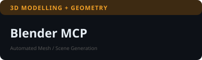

# 📂 MCP Project Catalog

A detailed look at the Model Context Protocol (MCP) servers in the sandraschi fleet.
Every server features a vibrant webapp sidecar for human control and real-time telemetry.

---

## 🧱 Maker Pipeline — CAD → Simulation → Viz → Export

The newest and most ambitious layer. Creative input, parametric CAD, CFD simulation,
game engine visualization, and export to XR, web, and desktop — all connected via MCP bridges.

| [](https://github.com/sandraschi/godot-mcp#readme) | [](https://github.com/sandraschi/freecad-mcp#readme) |
| :--- | :--- |
| **[godot-mcp](https://github.com/sandraschi/godot-mcp)** | **[freecad-mcp](https://github.com/sandraschi/freecad-mcp)** |
| Godot 4 engine control via MCP. STL import, CFD velocity fields, GPU particles, PBR materials, HTML5 export. The fleet's visualization endpoint. | Parametric CAD via MCP. STEP/BIM/IFC for architecture and mechanical engineering. |

| [](https://github.com/sandraschi/qcad-mcp#readme) | [](https://github.com/sandraschi/blender-mcp#readme) |
| :--- | :--- |
| **[qcad-mcp](https://github.com/sandraschi/qcad-mcp)** | **[blender-mcp](https://github.com/sandraschi/blender-mcp)** |
| 2D/3D drafting via MCP. DXF/STL export. Depot management and file watchers. | Automated 3D mesh and scene generation via Blender Python API. |

| [](https://github.com/sandraschi/gimp-mcp#readme) | [](https://github.com/sandraschi/worldlabs-mcp#readme) |
| :--- | :--- |
| **[gimp-mcp](https://github.com/sandraschi/gimp-mcp)** | **[worldlabs-mcp](https://github.com/sandraschi/worldlabs-mcp)** |
| Automated image processing and texture pipeline for asset creation. | AI-driven world and terrain generation. Landscape design for virtual environments. |

| [](https://github.com/sandraschi/inkscape-mcp#readme) | [](https://github.com/sandraschi/davinci-resolve-mcp#readme) |
| :--- | :--- |
| **[inkscape-mcp](https://github.com/sandraschi/inkscape-mcp)** | **[davinci-resolve-mcp](https://github.com/sandraschi/davinci-resolve-mcp)** |
| Vector graphics and SVG illustration automation substrate. | Automated post-production and color grading pipeline. |

---

## 🤖 Robotics & Hardware

Physical and simulated robots, plus avatar identity for virtual embodiment.

| [](https://github.com/sandraschi/yahboom-mcp#readme) | [](https://github.com/sandraschi/dreame-mcp#readme) |
| :--- | :--- |
| **[yahboom-mcp](https://github.com/sandraschi/yahboom-mcp)** | **[dreame-mcp](https://github.com/sandraschi/dreame-mcp)** |
| ROS 2 bridge for Raspberry Pi 5 robotics. Two-brain cognition (Gemma/Claude). | DreameHome robot vacuum API. Lidar mapping, navigation, autonomous platform. |

| [](https://github.com/sandraschi/robotics-mcp#readme) | [](https://github.com/sandraschi/avatar-mcp#readme) |
| :--- | :--- |
| **[robotics-mcp](https://github.com/sandraschi/robotics-mcp)** | **[avatar-mcp](https://github.com/sandraschi/avatar-mcp)** |
| ROS 2 bridge and simulation environments. Deploy CAD designs to physical robots. | Identity and animation control for VRChat, Resonite, and godot-mcp avatars. |

| [](https://github.com/sandraschi/vroidstudio-mcp#readme) | |
| :--- | :--- |
| **[vroidstudio-mcp](https://github.com/sandraschi/vroidstudio-mcp)** | |
| Automated 3D character pipeline. VRM avatars with bone rigs and blend shapes. | |

---

## 🌐 Virtual Worlds & XR

| [](https://github.com/sandraschi/resonite-mcp#readme) | [](https://github.com/sandraschi/osc-mcp#readme) |
| :--- | :--- |
| **[resonite-mcp](https://github.com/sandraschi/resonite-mcp)** | **[osc-mcp](https://github.com/sandraschi/osc-mcp)** |
| Real-time VR integration via ProtoFlux/Websockets. XR export endpoint for godot-mcp scenes. | Universal protocol bridge for real-time sensor and controller transport. |

| [](https://github.com/sandraschi/unity3d-mcp#readme) | |
| :--- | :--- |
| **[unity3d-mcp](https://github.com/sandraschi/unity3d-mcp)** | |
| Virtual robotics and physics simulation lab for training and testing. | |

---

## 🧠 Knowledge & Research

| [](https://github.com/sandraschi/arxiv-mcp#readme) | [](https://github.com/sandraschi/advanced-memory-mcp#readme) |
| :--- | :--- |
| **[arxiv-mcp](https://github.com/sandraschi/arxiv-mcp)** | **[advanced-memory-mcp](https://github.com/sandraschi/advanced-memory-mcp)** |
| Scientific paper search, full-text extraction, citation tracing. Clean pipe into arXiv. | Zettelkasten knowledge base with 200+ curated semantic skills and memory. |

| [](https://github.com/sandraschi/calibre-mcp#readme) | [](https://github.com/sandraschi/aiwatcher-mcp#readme) |
| :--- | :--- |
| **[calibre-mcp](https://github.com/sandraschi/calibre-mcp)** | **[aiwatcher-mcp](https://github.com/sandraschi/aiwatcher-mcp)** |
| 13,000 ebook library with semantic RAG search and full-text indexing. | AI activity monitoring, audit logging, and fleet observability. |

---

## 🎮 Fun & Games

| [](https://github.com/sandraschi/games-app#readme) | [](https://github.com/sandraschi/xkcd-mcp#readme) |
| :--- | :--- |
| **[games-app](https://github.com/sandraschi/games-app)** | **[xkcd-mcp](https://github.com/sandraschi/xkcd-mcp)** |
| Local entertainment grid management and emulation orchestration. | Comic retrieval and semantic search over the xkcd humor corpus. |

---

## 🏠 Home & Infrastructure

| [](https://github.com/sandraschi/devices-mcp#readme) | [](https://github.com/sandraschi/mywienerlinien#readme) |
| :--- | :--- |
| **[devices-mcp](https://github.com/sandraschi/devices-mcp)** | **[mywienerlinien](https://github.com/sandraschi/mywienerlinien)** |
| Unified interface for Smart Home control and IoT grid management. | Real-time Vienna city transit (Wiener Linien) API integration. |

---

## 🎬 Media & Streaming

| [](https://github.com/sandraschi/plex-mcp#readme) | |
| :--- | :--- |
| **[plex-mcp](https://github.com/sandraschi/plex-mcp)** | |
| Automated Plex media server management and library curation. | |

---

## 🛠️ Dev & Platform

| [](https://github.com/sandraschi/meta_mcp#readme) | [](https://github.com/sandraschi/git-github-mcp#readme) |
| :--- | :--- |
| **[meta_mcp](https://github.com/sandraschi/meta_mcp)** | **[git-github-mcp](https://github.com/sandraschi/git-github-mcp)** |
| Self-aware MCP server management and tool diagnostics. | Autonomous repository lifecycle and version control orchestration. |

| [](https://github.com/sandraschi/dark-app-factory#readme) | [](https://github.com/sandraschi/filesystem-mcp#readme) |
| :--- | :--- |
| **[dark-app-factory](https://github.com/sandraschi/dark-app-factory)** | **[filesystem-mcp](https://github.com/sandraschi/filesystem-mcp)** |
| Unattended fleet automation plane for industrial-grade operations. | Hardened distributed file management and storage substrate. |

---

## 🧪 Experiments & Alpha

Early-stage, speculative, or infrastructure scaffolding. Not daily drivers — here because
they're ambitious and interesting.

| [](https://github.com/sandraschi/openclaude-mcp#readme) | [](https://github.com/sandraschi/openmanus-mcp#readme) |
| :--- | :--- |
| **[openclaude-mcp](https://github.com/sandraschi/openclaude-mcp)** `alpha` | **[openmanus-mcp](https://github.com/sandraschi/openmanus-mcp)** `alpha` |
| Control plane for the 2026 Claude Code harness. FastMCP 3.2 harness with local Ollama inference. | Subprocess runner for OpenManus FOSS agent CLI. |

| [](https://github.com/sandraschi/robofang#readme) | |
| :--- | :--- |
| **[robofang](https://github.com/sandraschi/robofang)** `alpha` | |
| Sovereign orchestration hub. Multi-agent council, fleet management, VR bridges. Ambitious scaffolding. | |

---

<details>
<summary><strong>🤓 How do these visual cards work?</strong></summary>

Each card above is a plain `.svg` file sitting in the `assets/` folder. GitHub's Markdown
renderer displays inline images natively — so `[](...)`
gives you a clickable image that renders as a styled card, with no JavaScript, no external
fonts, no CDN, no CSS files, no build step.

The SVG itself carries everything inline:

```xml
<svg width="400" height="120" xmlns="http://www.w3.org/2000/svg">
  <rect width="100%" height="100%" fill="#0d1117" rx="10"/>
  <rect width="100%" height="30" fill="#993556" rx="10" opacity="0.4"/>
  <text x="20" y="20" font-family="sans-serif" font-size="12"
        font-weight="bold" fill="#ED93B1" letter-spacing="1">CATEGORY</text>
  <text x="20" y="75" font-family="sans-serif" font-size="24"
        font-weight="800" fill="#e6edf3">Server Name</text>
  <text x="20" y="100" font-family="sans-serif" font-size="10"
        fill="#555">SHORT DESCRIPTION</text>
</svg>
```

</details>

---

*Homespun Fleet · Alsergrund Node · Vienna · 2026*

---

## 📋 Full Fleet Registry

<details>
<summary><strong>Expand: all 126+ repos by category</strong> (click to open)</summary>

### 🧱 CAD / 3D / Maker

| Repo | Description |
| :--- | :--- |
| [blender-mcp](https://github.com/sandraschi/blender-mcp) | Automated 3D mesh / scene generation via Blender Python API |
| [freecad-mcp](https://github.com/sandraschi/freecad-mcp) | Parametric CAD — STEP / BIM / IFC for architecture and engineering |
| [qcad-mcp](https://github.com/sandraschi/qcad-mcp) | 2D/3D drafting — DXF/STL export, depot management, file watchers |
| [godot-mcp](https://github.com/sandraschi/godot-mcp) | Godot 4 engine — STL import, CFD viz, GPU particles, PBR, HTML5 export |
| [gimp-mcp](https://github.com/sandraschi/gimp-mcp) | Automated image processing and texture pipeline |
| [inkscape-mcp](https://github.com/sandraschi/inkscape-mcp) | Vector graphics and SVG automation substrate |
| [davinci-resolve-mcp](https://github.com/sandraschi/davinci-resolve-mcp) | Automated post-production and color grading pipeline |
| [worldlabs-mcp](https://github.com/sandraschi/worldlabs-mcp) | AI-driven world and terrain generation |
| [codecad-mcp](https://github.com/sandraschi/codecad-mcp) | Parametric CAD via build123d — code-driven mechanical design |
| [kicad-mcp](https://github.com/sandraschi/kicad-mcp) | PCB design and schematic capture — hybrid CLI/IPC bridge |
| [tahoma2d-mcp](https://github.com/sandraschi/tahoma2d-mcp) | Tahoma2D animation bridge for 2D production |
| [splatmaker-mcp](https://github.com/sandraschi/splatmaker-mcp) | Self-hosted Gaussian-splat 3D scene generation |

### 🤖 Robotics & Simulation

| Repo | Description |
| :--- | :--- |
| [yahboom-mcp](https://github.com/sandraschi/yahboom-mcp) | ROS 2 bridge for Raspberry Pi 5 — two-brain cognition (Gemma/Claude) |
| [dreame-mcp](https://github.com/sandraschi/dreame-mcp) | Dreame robot vacuum — lidar mapping, navigation, autonomous platform |
| [robotics-mcp](https://github.com/sandraschi/robotics-mcp) | ROS 2 bridge and simulation environments |
| [ros-mcp](https://github.com/sandraschi/ros-mcp) | Generic ROS 2 bridge — topics, services, params, bags, launch |
| [mujoco-mcp](https://github.com/sandraschi/mujoco-mcp) | General-purpose MuJoCo simulation server |
| [limx-robotics-mcp](https://github.com/sandraschi/limx-robotics-mcp) | MuJoCo sim lifecycle + VLA bridge for LIMX robots |
| [unitree-mcp](https://github.com/sandraschi/unitree-mcp) | Unitree robot sim — MuJoCo + ROS 2 bridge |
| [isaac-mcp](https://github.com/sandraschi/isaac-mcp) | NVIDIA Isaac Sim/Lab simulation server |
| [gazebo-mcp](https://github.com/sandraschi/gazebo-mcp) | General-purpose Gazebo sim bridge |
| [vla-mcp](https://github.com/sandraschi/vla-mcp) | VLA (Vision-Language-Action) / wall-x bridge for embodied AI |
| [teleoperator-mcp](https://github.com/sandraschi/teleoperator-mcp) | WebXR teleoperation client for Pico headsets |
| [chip-design-mcp](https://github.com/sandraschi/chip-design-mcp) | EDA orchestration for chip/VLSI design |
| [simbench-mcp](https://github.com/sandraschi/simbench-mcp) | Cross-simulator benchmark layer |

### 🌐 Virtual Worlds & XR

| Repo | Description |
| :--- | :--- |
| [resonite-mcp](https://github.com/sandraschi/resonite-mcp) | Real-time VR integration via ProtoFlux/WebSockets |
| [osc-mcp](https://github.com/sandraschi/osc-mcp) | Universal protocol bridge — real-time sensor/controller transport |
| [unity3d-mcp](https://github.com/sandraschi/unity3d-mcp) | Virtual robotics and physics simulation lab |
| [avatar-mcp](https://github.com/sandraschi/avatar-mcp) | Identity and animation control for VRChat/Resonite/Godot avatars |
| [vroidstudio-mcp](https://github.com/sandraschi/vroidstudio-mcp) | Automated 3D character pipeline — VRM avatars with bone rigs |
| [lewm-mcp](https://github.com/sandraschi/lewm-mcp) | LeWorldModel bridge — world state modeling |
| [overte-mcp](https://github.com/sandraschi/overte-mcp) | Overte open-source metaverse platform bridge |
| [vrchat-mcp](https://github.com/sandraschi/vrchat-mcp) | VRChat platform integration |

### 🧠 Knowledge & Research

| Repo | Description |
| :--- | :--- |
| [arxiv-mcp](https://github.com/sandraschi/arxiv-mcp) | Scientific paper search, full-text extraction, citation tracing |
| [advanced-memory-mcp](https://github.com/sandraschi/advanced-memory-mcp) | Zettelkasten knowledge base — 200+ semantic skills, RAG, LanceDB |
| [calibre-mcp](https://github.com/sandraschi/calibre-mcp) | 13K ebook library with semantic RAG search and full-text indexing |
| [aiwatcher-mcp](https://github.com/sandraschi/aiwatcher-mcp) | AI news ingestion, distillation, and alert pipeline |
| [depot-mcp](https://github.com/sandraschi/depot-mcp) | Artifact depot — cross-repo lookups, caching, LanceDB index |
| [documentation-mcp](https://github.com/sandraschi/documentation-mcp) | Public docs hub — fleet-wide documentation server |
| [notebooklm-fleet-mcp](https://github.com/sandraschi/notebooklm-fleet-mcp) | Fleet-context notebook for LLM research sessions |
| [obsidian-mcp](https://github.com/sandraschi/obsidian-mcp) | Obsidian vault bridge — read/write notes programmatically |
| [quicknotes-mcp](https://github.com/sandraschi/quicknotes-mcp) | Quick capture notes — CRUD, import/export, converter |
| [leanforge-mcp](https://github.com/sandraschi/leanforge-mcp) | Lean 4 formal proof search — LLM + compiler feedback loop |
| [bumi-mcp](https://github.com/sandraschi/bumi-mcp) | Noetix Bumi humanoid knowledge base and personality engine |

### 🛠️ Developer Tools

| Repo | Description |
| :--- | :--- |
| [meta_mcp](https://github.com/sandraschi/meta_mcp) | Self-aware MCP server management and tool diagnostics |
| [git-github-mcp](https://github.com/sandraschi/git-github-mcp) | Autonomous repository lifecycle and version control orchestration |
| [dark-app-factory](https://github.com/sandraschi/dark-app-factory) | Unattended fleet automation plane for industrial operations |
| [filesystem-mcp](https://github.com/sandraschi/filesystem-mcp) | Hardened distributed file management and storage substrate |
| [docker-mcp](https://github.com/sandraschi/docker-mcp) | Docker container lifecycle via MCP |
| [podman-mcp](https://github.com/sandraschi/podman-mcp) | Podman container management |
| [scraper-mcp](https://github.com/sandraschi/scraper-mcp) | Web scraping pipeline — archive, FTS, agentic retrieval |
| [system-admin-mcp](https://github.com/sandraschi/system-admin-mcp) | System administration tools — users, services, disk, firewall |
| [web-development-mcp](https://github.com/sandraschi/web-development-mcp) | Web dev tools — HTML/CSS/JS generation and analysis |
| [browser-mcp](https://github.com/sandraschi/browser-mcp) | Browser automation — control + bookmarks dashboard |
| [reversing-mcp](https://github.com/sandraschi/reversing-mcp) | Reverse engineering toolkit — binary analysis, disassembly |
| [copy-fail-mcp](https://github.com/sandraschi/copy-fail-mcp) | Copy-failure debugger — clipboard path diagnostics |
| [tailscale-mcp](https://github.com/sandraschi/tailscale-mcp) | Tailscale network management — ACLs, DNS, devices |
| [toolbench-mcp](https://github.com/sandraschi/toolbench-mcp) | ToolBench agentic tool quality scoring and audit |
| [repomix-mcp](https://github.com/sandraschi/repomix-mcp) | Repository mix/remix — codebase analysis and restructuring |
| [forgejo-mcp](https://github.com/sandraschi/forgejo-mcp) | Forgejo self-hosted git platform bridge |
| [ocaml-mcp](https://github.com/sandraschi/ocaml-mcp) | OCaml toolchain and build system bridge |
| [rustdesk-mcp](https://github.com/sandraschi/rustdesk-mcp) | RustDesk remote desktop management |
| [disk-usage-mcp](https://github.com/sandraschi/disk-usage-mcp) | Disk usage analysis and visualization |

### 💬 Chat & AI / LLM

| Repo | Description |
| :--- | :--- |
| [local-llm-mcp](https://github.com/sandraschi/local-llm-mcp) | Local LLM inference — Ollama/LM Studio bridge, chat, TTS/STT |
| [openclaude-mcp](https://github.com/sandraschi/openclaude-mcp) | Claude Code harness — FastMCP 3.2 + Ollama inference |
| [deepfang](https://github.com/sandraschi/deepfang) | Sovereign multi-agent orchestration hub with DeepSeek adjudicator |
| [google-ai-mcp](https://github.com/sandraschi/google-ai-mcp) | Google AI platform — Gemini, Imagen, Veo, Lyria, embeddings |
| [kyutai-mcp](https://github.com/sandraschi/kyutai-mcp) | Kyutai AI models bridge (Moshi, Helium) |
| [llm-txt-mcp](https://github.com/sandraschi/llm-txt-mcp) | llms.txt discovery, generation, and hub for fleet repos |
| [speech-mcp](https://github.com/sandraschi/speech-mcp) | Speech gateway — TTS/STT via SAPI5 + cloud |
| [agy-mcp](https://github.com/sandraschi/agy-mcp) | Antigravity IDE MCP bridge — skills, config, providers |
| [cline-mcp](https://github.com/sandraschi/cline-mcp) | Cline coding agent MCP wrapper |
| [zed-mcp](https://github.com/sandraschi/zed-mcp) | Zed editor MCP — settings, themes, extensions, projects |
| [cursor-mcp](https://github.com/sandraschi/cursor-mcp) | Cursor IDE platform API — usage/spend guardrails |
| [opencode-cli-mcp](https://github.com/sandraschi/opencode-cli-mcp) | OpenCode CLI bridge — sessions, config, fleet status |
| [openmanus-mcp](https://github.com/sandraschi/openmanus-mcp) | OpenManus FOSS agent CLI subprocess runner |
| [goose-mcp](https://github.com/sandraschi/goose-mcp) | Goose AI agent platform bridge |
| [learnbot-mcp](https://github.com/sandraschi/learnbot-mcp) | AI chatbot orchestrator — personas, SRS, safety, platforms |
| [chitchat](https://github.com/sandraschi/chitchat) | Lightweight chat server with personality system |
| [giskard-mcp](https://github.com/sandraschi/giskard-mcp) | Giskard red-team LLM vulnerability scanning |
| [moltbot-mcp](https://github.com/sandraschi/moltbot-mcp) | Moltbot agent bridge |

### 🎬 Media & Audio

| Repo | Description |
| :--- | :--- |
| [plex-mcp](https://github.com/sandraschi/plex-mcp) | Automated Plex media server management and library curation |
| [jellyfin-mcp](https://github.com/sandraschi/jellyfin-mcp) | Jellyfin media server — library, playback, WebSocket events |
| [readly-mcp](https://github.com/sandraschi/readly-mcp) | Readly digital magazine platform bridge |
| [audiotool-nexus-mcp](https://github.com/sandraschi/audiotool-nexus-mcp) | Audiotool online DAW bridge |
| [songgeneration-mcp](https://github.com/sandraschi/songgeneration-mcp) | AI song generation — lyrics, composition, arrangement |
| [suno-mcp](https://github.com/sandraschi/suno-mcp) | Suno AI music generation API bridge |
| [sfx-mcp](https://github.com/sandraschi/sfx-mcp) | Sound effects — FreeSound API wrapper + local library |
| [stems-mcp](https://github.com/sandraschi/stems-mcp) | ONNX HTDemucs v4 stem separation — isolate vocals/drums/bass |
| [vfx-mcp](https://github.com/sandraschi/vfx-mcp) | FFmpeg video effects — compositing and post-processing |
| [videogen-mcp](https://github.com/sandraschi/videogen-mcp) | Topic-to-narrated-video pipeline (ittybitty) |
| [mixx-dj-mcp](https://github.com/sandraschi/mixx-dj-mcp) | Mixxx DJ software — OSC bridge, deck control, BPM sync |
| [resolume-mcp](https://github.com/sandraschi/resolume-mcp) | Resolume Arena VJ software bridge |
| [butterchurn-mcp](https://github.com/sandraschi/butterchurn-mcp) | MilkDrop WebGL visualizer — real-time audio-reactive visuals |
| [virtualdj-mcp](https://github.com/sandraschi/virtualdj-mcp) | VirtualDJ deck control via MCP |
| [reaper-mcp](https://github.com/sandraschi/reaper-mcp) | REAPER DAW automation — tracks, FX, rendering |
| [obs-mcp](https://github.com/sandraschi/obs-mcp) | OBS Studio bridge — scenes, sources, streaming control |
| [vcv-rack-mcp](https://github.com/sandraschi/vcv-rack-mcp) | VCV Rack modular synth — patch depot, catalog API |
| [grandorgue-mcp](https://github.com/sandraschi/grandorgue-mcp) | GrandOrgue pipe organ — console control via MCP |
| [musicpaint-mcp](https://github.com/sandraschi/musicpaint-mcp) | Audio player + paintings slideshow — sync engine |
| [directmedia-mcp](https://github.com/sandraschi/directmedia-mcp) | DirectShow media control bridge |

### 🎮 Games & Fun

| Repo | Description |
| :--- | :--- |
| [games-app](https://github.com/sandraschi/games-app) | Local entertainment grid — Stockfish, KataGo, Hex, Backgammon, Othello engines |
| [xkcd-mcp](https://github.com/sandraschi/xkcd-mcp) | xkcd comic retrieval and semantic search |
| [tvtropes-mcp](https://github.com/sandraschi/tvtropes-mcp) | TV Tropes scraper and trope search |
| [steam-mcp](https://github.com/sandraschi/steam-mcp) | Steam Web API bridge — library, achievements, friends |
| [kick-mcp](https://github.com/sandraschi/kick-mcp) | Kick streaming platform API bridge |

### 🏠 Home & IoT

| Repo | Description |
| :--- | :--- |
| [devices-mcp](https://github.com/sandraschi/devices-mcp) | Smart home control and IoT grid management |
| [mywienerlinien](https://github.com/sandraschi/mywienerlinien) | Real-time Vienna city transit (Wiener Linien) API |
| [alexa-mcp](https://github.com/sandraschi/alexa-mcp) | Amazon Alexa smart home bridge |
| [home-assistant-mcp](https://github.com/sandraschi/home-assistant-mcp) | Home Assistant automation platform bridge |
| [ring-mcp](https://github.com/sandraschi/ring-mcp) | Ring doorbell/camera API bridge |
| [nest-protect-mcp](https://github.com/sandraschi/nest-protect-mcp) | Nest Protect smoke/CO alarm bridge |
| [netatmo-weather-mcp](https://github.com/sandraschi/netatmo-weather-mcp) | Netatmo weather station API |
| [nuki-mcp](https://github.com/sandraschi/nuki-mcp) | Nuki smart lock bridge |
| [health-mcp](https://github.com/sandraschi/health-mcp) | Health metrics and wellness tracking |
| [tapo-mcp](https://github.com/sandraschi/tapo-mcp) | TP-Link Tapo smart device bridge |
| [immich-mcp](https://github.com/sandraschi/immich-mcp) | Immich self-hosted photo/video management |
| [arr-mcp](https://github.com/sandraschi/arr-mcp) | *arr stack — Sonarr/Radarr/Lidarr/Prowlarr/Overseerr |
| [rtorrent-mcp](https://github.com/sandraschi/rtorrent-mcp) | rTorrent/ruTorrent client bridge |

### 🖥️ Windows & Desktop Automation

| Repo | Description |
| :--- | :--- |
| [pywinauto-mcp](https://github.com/sandraschi/pywinauto-mcp) | Windows UI automation — reference Tauri/NSIS/CUA impl |
| [windows-operations-mcp](https://github.com/sandraschi/windows-operations-mcp) | Windows control plane — accounts, services, registry, firewall, WMI |
| [windows-computer-use-mcp](https://github.com/sandraschi/windows-computer-use-mcp) | Desktop computer-use agent — UIA, OCR, mouse/keyboard |
| [winrar-mcp](https://github.com/sandraschi/winrar-mcp) | WinRAR archive automation bridge |
| [beyondcompare-mcp](https://github.com/sandraschi/beyondcompare-mcp) | Beyond Compare diff/merge tool bridge |
| [notepadpp-mcp](https://github.com/sandraschi/notepadpp-mcp) | Notepad++ editor automation |
| [libreoffice-mcp](https://github.com/sandraschi/libreoffice-mcp) | LibreOffice headless convert + extension bridge |
| [autohotkey-mcp](https://github.com/sandraschi/autohotkey-mcp) | AutoHotkey v2 script management and execution |
| [sysinternals-mcp](https://github.com/sandraschi/sysinternals-mcp) | Sysinternals toolkit bridge — Process Explorer, Autoruns, etc. |
| [fastsearch-mcp](https://github.com/sandraschi/fastsearch-mcp) | Everything fast file search integration |
| [handbrake-mcp](https://github.com/sandraschi/handbrake-mcp) | HandBrake video transcoding bridge |
| [bookmarks-mcp](https://github.com/sandraschi/bookmarks-mcp) | Browser bookmarks management across browsers |

### 📡 Electronics & Bench

| Repo | Description |
| :--- | :--- |
| [oscilloscope-mcp](https://github.com/sandraschi/oscilloscope-mcp) | USB oscilloscope bridge — waveform capture and analysis |
| [logic-analyzer-mcp](https://github.com/sandraschi/logic-analyzer-mcp) | Sigrok logic analyzer bridge — trace capture and decode |
| [function-generator-mcp](https://github.com/sandraschi/function-generator-mcp) | Arbitrary waveform generator bridge |
| [power-supply-mcp](https://github.com/sandraschi/power-supply-mcp) | Bench power supply control |
| [multimeter-mcp](https://github.com/sandraschi/multimeter-mcp) | Digital multimeter bridge |
| [spectrum-analyzer-mcp](https://github.com/sandraschi/spectrum-analyzer-mcp) | RTL-SDR / TinySA spectrum analyzer |
| [jtag-swd-mcp](https://github.com/sandraschi/jtag-swd-mcp) | JTAG/SWD debug probe via OpenOCD |
| [bus-pirate-mcp](https://github.com/sandraschi/bus-pirate-mcp) | Bus Pirate universal serial interface bridge |
| [bench-orchestrator-mcp](https://github.com/sandraschi/bench-orchestrator-mcp) | Cross-instrument workflow glue |
| [test-fixture-mcp](https://github.com/sandraschi/test-fixture-mcp) | YAML-defined automated test sequences |
| [bench-camera-mcp](https://github.com/sandraschi/bench-camera-mcp) | USB webcam snapshots for bench work |
| [smoke-detector-mcp](https://github.com/sandraschi/smoke-detector-mcp) | Bench safety — smoke/heat alerts |

### 🚀 Fleet Infrastructure

| Repo | Description |
| :--- | :--- |
| [fleet-agent-mcp](https://github.com/sandraschi/fleet-agent-mcp) | Fleet orchestration — cross-repo scheduling, intel reports |
| [fleetwatcher-mcp](https://github.com/sandraschi/fleetwatcher-mcp) | Fleet pulse — repo activity, build watch, session scan |
| [fleet-public-relations-mcp](https://github.com/sandraschi/fleet-public-relations-mcp) | Fleet PR — cross-repo stats, release notes, social feed |
| [monitoring-mcp](https://github.com/sandraschi/monitoring-mcp) | Fleet-wide Grafana/Loki/Prometheus observability |
| [observability-mcp](https://github.com/sandraschi/observability-mcp) | Per-process Prometheus metrics exporter |
| [glama-status-mcp](https://github.com/sandraschi/glama-status-mcp) | Glama MCP registry score scraper and fleet dashboard |
| [secrets-mcp](https://github.com/sandraschi/secrets-mcp) | Credential vault bridge — shared env for fleet servers |
| [multi-backup-mcp](https://github.com/sandraschi/multi-backup-mcp) | Multi-target backup orchestration |
| [admiral-mcp](https://github.com/sandraschi/admiral-mcp) | Agent-approval pager — human-in-the-loop for destructive ops |
| [fritz-test](https://github.com/sandraschi/fritz-test) | Fritz!Box router integration test harness |
| [mcp-studio](https://github.com/sandraschi/mcp-studio) | MCP Studio — IDE-like tool discovery and testing |

### 📧 Communication

| Repo | Description |
| :--- | :--- |
| [email-mcp](https://github.com/sandraschi/email-mcp) | Email management — IMAP/SMTP, search, send, folders |
| [discord-mcp](https://github.com/sandraschi/discord-mcp) | Discord platform bridge — messages, guilds, channels |
| [telephony-mcp](https://github.com/sandraschi/telephony-mcp) | Telephony audit log and call management |
| [teleconference-mcp](https://github.com/sandraschi/teleconference-mcp) | Teleconference platform bridge |

### 🔬 Specialized & Science

| Repo | Description |
| :--- | :--- |
| [openbci-mcp](https://github.com/sandraschi/openbci-mcp) | OpenBCI EEG headset bridge — real-time brain data |
| [magentart-mcp](https://github.com/sandraschi/magentart-mcp) | Magenta RT generative music in Docker |
| [ocr-mcp](https://github.com/sandraschi/ocr-mcp) | Tesseract OCR pipeline for document text extraction |
| [veogen](https://github.com/sandraschi/veogen) | Vector embedding generator — Ollama/LanceDB pipeline |
| [ednaficator](https://github.com/sandraschi/ednaficator) | DNA sequence analysis and visualization |
| [comfyops-mcp](https://github.com/sandraschi/comfyops-mcp) | ComfyUI sidecar — workflow-JSON generation for image gen |
| [wall-flower](https://github.com/sandraschi/wall-flower) | Wallpaper engine — generative/curated desktop art |
| [streamfog-mcp](https://github.com/sandraschi/streamfog-mcp) | StreamFog streaming overlay and scene management |
| [iflow-mcp-catalog](https://github.com/sandraschi/iflow-mcp-catalog) | iFlow MCP catalog — workflow templates and discovery |

### 🧪 Experiments & Alpha

| Repo | Description |
| :--- | :--- |
| [robofang](https://github.com/sandraschi/robofang) | Sovereign orchestration hub — multi-agent council, VR bridges |
| [vbot-mind-mcp](https://github.com/sandraschi/vbot-mind-mcp) | VBot cognitive architecture — mind/state management |
| [vienna-life-assistant](https://github.com/sandraschi/vienna-life-assistant) | Vienna life concierge — transit, events, services |
| [travelprep-mcp](https://github.com/sandraschi/travelprep-mcp) | Travel preparation — stays, destinations, itineraries |
| [colony-mcp](https://github.com/sandraschi/colony-mcp) | Colony simulation — agent-based emergent behavior |
| [sakana-mcp](https://github.com/sandraschi/sakana-mcp) | Sakana AI agentic research bridge |
| [mujoco-mcp](https://github.com/sandraschi/mujoco-mcp) | (see Robotics) |
| [openclaw-molt-mcp](https://github.com/sandraschi/openclaw-molt-mcp) | OpenClaw robotic claw bridge |
| [pinokio-mcp](https://github.com/sandraschi/pinokio-mcp) | Pinokio 1-click launcher platform bridge |
| [myai](https://github.com/sandraschi/myai) | Multi-container AI hub — Traefik, Weaviate, dashboards |
| [alsergrund-bridge](https://github.com/sandraschi/alsergrund-bridge) | Alsergrund district local service bridge |
| [gtfs-mcp](https://github.com/sandraschi/gtfs-mcp) | GTFS transit feed — schedule parsing and querying |
| [sketchboard-excalidraw-mcp](https://github.com/sandraschi/sketchboard-excalidraw-mcp) | Excalidraw canvas bridge — headless render, diagram gen |
| [classroom-mcp](https://github.com/sandraschi/classroom-mcp) | Classroom management — students, courses, assignments |
| [uitars-mcp](https://github.com/sandraschi/uitars-mcp) | UI-TARS vision agent bridge |
| [loot-mcp](https://github.com/sandraschi/loot-mcp) | Software license and entitlement tracking |
| [loona-mcp](https://github.com/sandraschi/loona-mcp) | Loona pet robot bridge |
| [status-mcp](https://github.com/sandraschi/status-mcp) | Service status page generator and monitor |
| [pihole-mcp](https://github.com/sandraschi/pihole-mcp) | Pi-hole DNS ad-blocking management bridge |
| [wasm-mcp](https://github.com/sandraschi/wasm-mcp) | WebAssembly toolchain and runtime bridge |
| [kubernetes-mcp](https://github.com/sandraschi/kubernetes-mcp) | Kubernetes cluster management bridge |
| [openrouter-mcp](https://github.com/sandraschi/openrouter-mcp) | OpenRouter API — multi-provider LLM routing |
| [triton-mcp](https://github.com/sandraschi/triton-mcp) | NVIDIA Triton inference server bridge |
| [llm-gateway](https://github.com/sandraschi/llm-gateway) | LLM gateway — rate limiting, caching, provider routing |
| [lidar-mcp](https://github.com/sandraschi/lidar-mcp) | LiDAR point-cloud processing and visualization |
| [sdr-mcp](https://github.com/sandraschi/sdr-mcp) | Software-defined radio bridge — RTL-SDR, HackRF |
| [packetsniffer-mcp](https://github.com/sandraschi/packetsniffer-mcp) | Packet capture and analysis — Wireshark/tshark bridge |
| [obscura-mcp](https://github.com/sandraschi/obscura-mcp) | Privacy and obfuscation toolkit |
| [4g-usb-phone-mcp](https://github.com/sandraschi/4g-usb-phone-mcp) | 4G USB dongle SMS/call bridge |
| [agiapi-mcp](https://github.com/sandraschi/agiapi-mcp) | AGI API gateway — multi-model orchestration |
| [dj-media-hub](https://github.com/sandraschi/dj-media-hub) | DJ media hub — cross-deck library sync |
| [rtorrent-mcp](https://github.com/sandraschi/rtorrent-mcp) | rTorrent client bridge |
| [database-operations-mcp](https://github.com/sandraschi/database-operations-mcp) | Database operations — multi-DB query and management |

</details>

---

*Homespun Fleet · Alsergrund Node · Vienna · 2026*
