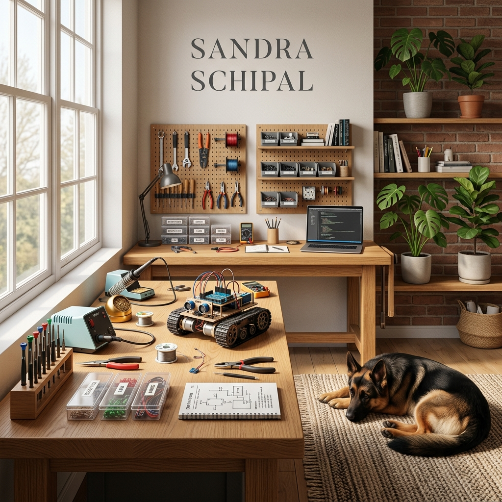
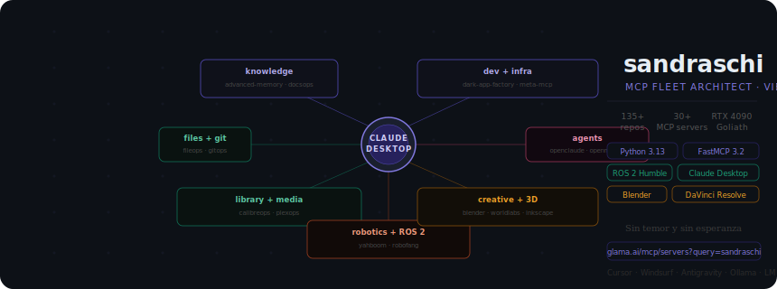
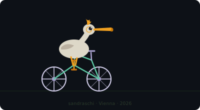
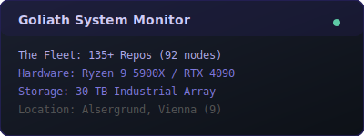

# ⚡ Sandra Schipal

I'm a reactivated software engineer living in the 9th District (Alsergrund), Vienna. I spend my time building DIY robotics, managing a fleet of MCP servers, and hanging out with my German Shepherd, Benny.

> **What is this repo?**
> GitHub shows a profile README when a repo matches your username (`sandraschi/sandraschi`). This is that repo — it renders directly on [github.com/sandraschi](https://github.com/sandraschi). Nothing to install, nothing to run. It's just a window into the workshop.

---

## 🛠️ My Setup

| Component | Specification |
| :--- | :--- |
| **Main Node (Goliath)** | AMD Ryzen 9 5900X / RTX 4090 24GB |
| **Memory** | 64GB DDR4 |
| **Storage** | 30TB HDD Array |
| **OS** | Windows 11 Pro |
| **IDEs** | Cursor · Windsurf · Antigravity |
| **Inference** | Ollama · LM Studio · Claude Desktop |

## 🌐 The MCP Fleet

I maintain a fleet of **135+ repos**, mostly MCP (Model Context Protocol) servers built on [FastMCP 3.2](https://gofastmcp.com). It's a homespun setup, connecting Claude Desktop to everything: files, git, Plex, Calibre, robotics, 3D tools, music production, Vienna transit, and a lot more.

All public servers are listed on [Glama](https://glama.ai/mcp/servers?query=sandraschi).

## 🤖 Radical Projects

A few repos that push further than the usual MCP tooling:

| Project | What |
| :--- | :--- |
| **[openclaude-mcp](https://github.com/sandraschi/openclaude-mcp)** | Control plane for the 2026 Claude Code harness. Hardened FastMCP 3.2, zero token cost local inference via Ollama. |
| **[openmanus-mcp](https://github.com/sandraschi/openmanus-mcp)** | Subprocess runner for OpenManus FOSS agent CLI — open-source agentic AI from the command line. |
| **[yahboom-mcp](https://github.com/sandraschi/yahboom-mcp)** | ROS 2 bridge for a Yahboom Raspbot V2 ("Boomy") running on a Raspberry Pi 5. Two-brain cognition: Gemma 4 on Pi + Claude/Ollama on Goliath. |
| **[robofang](https://github.com/sandraschi/robofang)** | Sovereign orchestration hub ("OpenClaw++"). Multi-agent council system, MCP fleet management, ROS 2 + Resonite VR bridges. |
| **[calibre-mcp](https://github.com/sandraschi/calibre-mcp)** | 13,000+ ebook library with semantic RAG search, arXiv/Gutenberg import, and location-aware full-text search. |
| **[advanced-memory-mcp](https://github.com/sandraschi/advanced-memory-mcp)** | Zettelkasten knowledge base with 200+ curated skills, BM25 CodeMode tool discovery, and multi-IDE skill management. |

## 🐾 Benny

**Benny** is a 2-year-old German Shepherd. He's the primary security consultant and tennis ball lifecycle manager in the Alsergrund node.

---

  

*Layout by **Gemini**, **Opus**, and **Qwen** in friendly competition. Pelican animation and SVG refinement by **Claude Sonnet 4.6**. 2026-04-07.*

