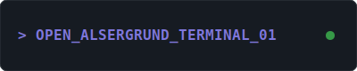

# ⚡ Sandra Schipal

> [!IMPORTANT]
> **Disclosure**
> This repository is implemented by Advanced Agentic AI. The era of manual keyboard-mashing FOSS is over. If you have philosophical objections to machine-native code: **[please exit](docs/AGENTIC_AI.md)**.

*Sandra's workshop, Alsergrund, Vienna — circa August 2026. Benny is real. The [Noetix Bumi](https://www.noetix.ai/) humanoid is aspirational (arriving soon).*

I'm a reactivated software engineer living in the 9th District (Alsergrund), Vienna. I build DIY robotics, maintain a fleet of 135+ MCP servers, and hang out with my German Shepherd Benny — and soon, a Noetix Bumi humanoid robot.

---

## 🌐 The MCP Fleet

I maintain a homespun fleet of **135+ repos**, mostly [MCP](https://modelcontextprotocol.io/) servers built on [FastMCP 3.2](https://gofastmcp.com). One **MCP Client** to rule them all: files, git, Plex, Calibre, robotics, 3D tools, music production, Vienna transit, and a lot more.

→ **[Full MCP Project Catalog](MCP_CATALOG.md)** — visual cards for every server in the fleet

---

## 🛠️ Live Workshop Terminal

> **Node: Alsergrund_01** — Live telemetry, local GPU status, and real-time Vienna Transit (U6) monitoring.

---

## 🤖 Radical Projects

| Project | What |
| :--- | :--- |
| **[openclaude-mcp](https://github.com/sandraschi/openclaude-mcp)** | Control plane for the 2026 Claude Code harness. Zero token cost via local Ollama inference. |
| **[yahboom-mcp](https://github.com/sandraschi/yahboom-mcp)** | ROS 2 bridge for "Boomy" (Yahboom Raspbot V2, RPi 5). Two-brain cognition: Gemma 4 on Pi + Claude/Ollama on Goliath. |
| **[robofang](https://github.com/sandraschi/robofang)** | Sovereign AI orchestration hub. Multi-agent council, MCP fleet management, ROS 2 + Resonite VR bridges. |
| **[calibre-mcp](https://github.com/sandraschi/calibre-mcp)** | 13,000 ebook library with semantic RAG search, arXiv/Gutenberg import, and full-text indexing. |
| **[advanced-memory-mcp](https://github.com/sandraschi/advanced-memory-mcp)** | Zettelkasten knowledge base with 200+ curated skills and BM25 CodeMode tool discovery. |

→ **[Workshop & Hardware Details](WORKSHOP.md)**

---

## 🐾 Benny

**Benny** is a 2-year-old German Shepherd. Primary security consultant and tennis ball lifecycle manager at the Alsergrund node.

---

  

  <a href="PELICAN.md">🐦 what's with the pelican?</a>

---

  <a href="assessment.md">Assessment</a> • 
  <a href="CHANGELOG.md">Changelog</a>

