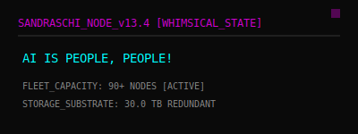

# ⚡ Sandra Schipal | Industrial Fleet Orchestration

> "Data constitutes the only objective reality. Industrial elegance is the only subjective necessity." — Vienna, 2026.

## ⚙️ Orbital Infrastructure (90+ Node Fleet)
*Status: Optimized for low-latency agentic orchestration and industrial-scale memory management.*

| Component | Specification | Operational Role |
| :--- | :--- | :--- |
| **Node ID** | `sandraschi-v13.6` | Primary Controller |
| **Fleet Scale** | **92 Active Nodes** | Distributed Orchestration |
| **OS** | Windows 11 Pro | System Interface |
| **CPU** | AMD Ryzen 9 5900X | Central Computational Grid |
| **GPU** | NVIDIA RTX 4090 | 24GB GDDR6X Inference Engine |
| **Memory** | 64GB DDR4-3200 | Dual-channel Buffer |
| **Storage** | 30.0 TB HDD Array | Persistent Knowledge Store |

## 🐾 Biological Sensors & Habitat
- **Companion**: **Benny** (2-year-old German Shepherd Dog). Active patrolling.
- **Location**: 9th District (Alsergrund), Vienna, Austria.
- **Security**: Tapo C-series grid, optimized for low-latency observation.

## 🛠️ MCP Fleet Registry (Industrial Grade)
- **robotics-mcp**: Physical (Unitree Go2) & Virtual (Unity3D) robot orchestration.
- **advanced-memory-mcp**: Zettelkasten knowledge graphs & skill integration.
- **pywinauto-mcp**: Windows UI analysis and automated control plane.

---
*Layout performed by **Gemini**, **Opus**, and **Qwen** in hot, cut-throat competition. Verified by the Antigravity Neural Grid. 2026-04-07.*
