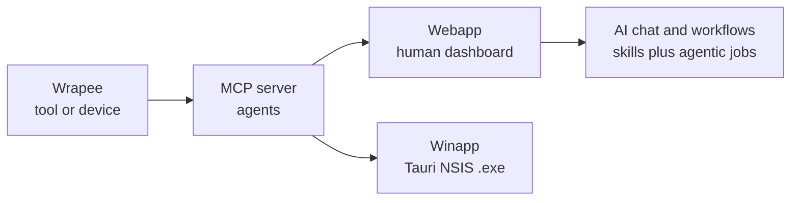

# Sandra's Repo Fleet

> Human-architected, AI-implemented: I design, agents code. [What that means](docs/AGENTIC_AI.md)

Retired software engineer, 9th District Vienna. I wrap everyday tools in a five-layer fleet pattern, then snap repos together into pipelines. 190+ small repos, one idea.

Start here: **[Why so many repos?](WHY_FLEET.md)** - plain-language value prop, 3 minutes.

```mermaid
flowchart LR
  W[Wrapee<br/>tool or device]
  M[MCP server<br/>agents]
  B[Webapp<br/>human dashboard]
  D[Winapp<br/>Tauri NSIS .exe]
  A[AI chat and workflows<br/>skills plus agentic jobs]
  W --> M
  M --> B
  M --> D
  B --> A
```

Each repo ships all five: the **wrapee** you already use, an **MCP server** for Claude or Cursor, **webapp** and **winapp** for humans, and **AI specialist chat and workflows** in the web stack.

---

## The idea in 30 seconds

- **One wrapee per repo, five layers.** Each repo wraps one app or device you already use (Blender, QCAD, Plex, a Yahboom robot car, Vienna transit): MCP tools for agents, a dark web dashboard, a Tauri Windows app (NSIS .exe), plus in-app AI chat fed by domain skills and agentic workflows.
- **Human faces are not decoration.** Agents act, humans approve. Watch telemetry, sign off on posts and destructive ops, hit the big red stop button.
- **Every repo has intrinsic AI.** A chat page that ingests bespoke domain skills (ask yahboom-mcp about robot types in plain words) plus agentic workflows that run multi-step jobs locally. Details: **[Why the fleet looks like this](WHY_FLEET.md)**.
- **They snap together, optionally.** Any repo runs alone. When two repos know each other they offer a 1-hop link (CAD file to 3D print to robot mount to VR twin to spoken "done"). No forced installs, friendly error if the peer is missing.

Details: **[Why the fleet looks like this](WHY_FLEET.md)** - why one repo per tool, why a webapp each, what crossconnects do, and an honest note on stars.

---

## Where to go next

| If you want... | Go to |
|---|---|
| Design things, move robots, meet in VR (the interlock chain) | **[Make / Move / Meet](FLEET_MAKE_MOVE_MEET.md)** - Blender, QCAD, FreeCAD, Resonite VR, Yahboom, Dreame, Nori, Unitree |
| Sound, video, DJ sets, knowledge, everyday Vienna life | **[Play / Know / Home](FLEET_PLAY_KNOW_HOME.md)** - Mixxx, stems, Resolume, memory, Calibre, arXiv, Plex, transit |
| Every server in one registry | **[Full MCP Catalog](MCP_CATALOG.md)** - 126+ repos by category |
| How repos link (clickable graph + rules) | **[Fleet Crossconnects](FLEET_CROSSCONNECTS.md)** - pipelines, 1-hop contract, soft degradation |
| Two deep dives, kept separate on purpose | **[Fleet Highlights](HIGHLIGHTS.md)** (mobile-DJ video fork, Lean proof loop) - **[Coming Next](COMING_NEXT.md)** (local sovereign agent, 0 EUR per token) |
| The machine and the hardware behind it | **[Workshop](WORKSHOP.md)** - Goliath, RTX 4090, Boomy, Bumi |
| Who runs this (workshop photo, Benny, follows, thanks) | **[About Sandra](ABOUT.md)** - the personal tail, kept off this page on purpose |
| How it is built (developers: tools, tests, standards, CI) | **[Dev Stack](DEV_STACK.md)** - very technical, everyone else stop here |
| The rogues' gallery (Alexa air-gap, listening ops, live demos) | **[Sneaky Feats](SNEAKY_FEATS.md)** - mischief with guardrails |
| So you want to be a v̶i̶b̶e̶c̶o̶d̶e̶r̶ "agentic architect" | **[Vibecoding Notes](VIBECODING_NOTES.md)** - subscription round-robin, DeepSeek peak-hour gotchas |
