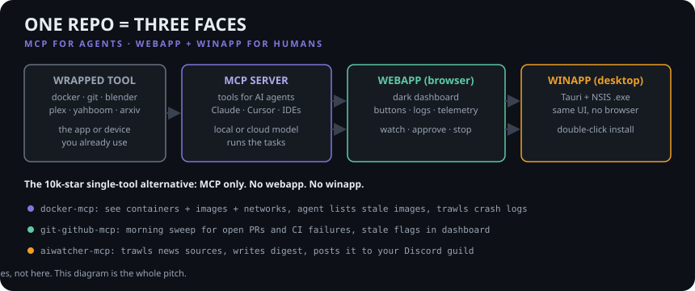
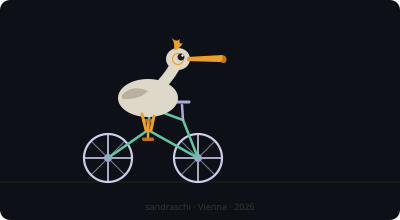

# ⚡ Sandra Schipal

> [!NOTE]
> **These repositories are human-architected, AI-implemented.**
> Architecture, design decisions, and system integration are mine. Code generation and iteration are done by AI agents under my direction. [More on what that means and why →](docs/AGENTIC_AI.md)

*Sandra's workshop, Alsergrund, Vienna. Benny is real. The [Noetix Bumi](https://www.noetix.ai/) humanoid is aspirational (arriving soon).*

I'm a retired and vibe-reactivated software engineer living in the 9th District (Alsergrund), Vienna. I build DIY robotics, maintain a fleet of 180+ MCP servers, and hang out with my German Shepherd Benny — and soon, a Noetix Bumi humanoid robot.

---

## 🌐 The MCP Fleet

I maintain a homespun fleet of **180+ repos**, each an MCP server with an associated webapp. MCP for agents, webapp for humans — files, git, Plex, Calibre, robotics, 3D tools, music production, Vienna transit, and a lot more. Built on [FastMCP 3.4](https://gofastmcp.com).

> 🌙 **All webapps are permanently dark mode. Night-owl approved.** No light toggle, no plans for one. Dim your OLEDs accordingly.

→ **[Full MCP Project Catalog](MCP_CATALOG.md)** — visual cards for every server in the fleet

---

## 🔥 Current highlight

### mixx-dj-mcp: an MCP server, a webapp, and a fork that changed everything

[mixx-dj-mcp](https://github.com/sandraschi/mixx-dj-mcp) is a new MCP server and
webapp for Mixxx — OSC bridge, deck control, BPM sync, full remote DJ dashboard.
But the bigger story is what it unlocked.

[Mixxx](https://mixxx.org) is a 300,000-line C++ DJ application, grown slowly over
years by conservative greybeard devs. Solid, respected, missing crucial features
its users begged for: video mixing, stem separation, AI-assisted automation. The
dev team wanted to add them. Nobody had the bandwidth.

DeepSeek V4 on opencode added **5,000 lines of C++** to the [mixxxx fork](https://github.com/sandraschi/mixxxxx)
and filled every gap:

- *"We need VFX."* — "Use FFmpeg. It's fast, battle-tested, ships everywhere."
- *"We need synced video like Resolume."* — "Use MilkDrop / [ButterChurn](https://github.com/jberg/butterchurn). It's WebGL, FOSS, and already handles audio-reactive visuals."
- *"We need stem separation."* — "ONNX HTDemucs v4. Runs on the GPU. Zero cloud."

The [mixxxx fork](https://github.com/sandraschi/mixxxxx) is the integration testbed.
It's not a toy — it's Mixxx with video, stems, and AI control, implemented by an AI
that has never been to a club. The greybeards are impressed. The users have features.
The AI doesn't need domain expertise. It needs a clear spec.

**I am not a DJ.** I don't know how to beatmatch. But I know what the software should
do, and that was enough. This is SHN in practice: a
non-expert directing an AI to extend a 300K-line C++ codebase, and the AI delivering
production-quality features that the expert dev team couldn't prioritize.

<!-- -->

### leanforge-mcp: formal proofs, no math degree

[Lean 4](https://lean-lang.org) is a proof assistant — a programming language where
the compiler verifies that your code is mathematically correct. Using it traditionally
requires a PhD in logic or months of study. [leanforge-mcp](https://github.com/sandraschi/leanforge-mcp) automates the hard part:
an LLM proposes a proof, the Lean compiler checks it, the LLM reads the error and
tries again. Loop until verified.

**I am not a math wiz.** I can't write a Lean proof by hand. But I can frame the
conjecture, and the AI + compiler feedback loop handles the rest. This is the same
pattern as AlphaProof but running on a consumer GPU with open-weight models.

Two repos, same story: domain-specific superhuman performance, directed by someone who
isn't an expert in either domain. Architecture and taste are the human contribution.
The AI handles the part that used to take a degree.

→ **[Superhuman Narrow →](docs/SUPERHUMAN_NARROW.md)** — the full argument

→ **[Full catalog →](MCP_CATALOG.md)** • **[Workshop & Hardware](WORKSHOP.md)** • **[SHN →](docs/SUPERHUMAN_NARROW.md)** • **[Shenzhen Robotics →](docs/SHENZHEN_ROBOTICS.md)** • **[Bloopers →](docs/BLOOPERS.md)**

---

## 🐾 Benny

**Benny** is a 2-year-old German Shepherd. Primary security consultant and tennis ball lifecycle manager at the Alsergrund node.

---

## 📚 External references

People and sites worth following (no slop):

| | |
|---|---|
| 🐦 **Simon Willison** | [simonwillison.net](https://simonwillison.net) — agentic engineering patterns, AI benchmarks. The pelican test is his. |
| ⚡ **FastMCP** | [gofastmcp.com](https://gofastmcp.com) — the framework every server in this fleet is built on. |
| 🧮 **Lean 4** | [lean-lang.org](https://lean-lang.org) — formal proof verification. leanforge-mcp runs on this. |
| 📄 **arXiv** | [arxiv.org](https://arxiv.org) — where the useful papers live before the blog posts. |
| 🎥 **Andrej Karpathy** | [YouTube](https://youtube.com/@andrejkarpathy) — zero-hype technical AI. The "Intro to LLMs" talk is still the best single explanation. |
| 🎥 **AI Explained** | [YouTube](https://youtube.com/@aiexplained-official) — covers actual research, not product launches. Best depth-to-accessibility ratio. |
| 🎥 **ThePrimeTime** | [YouTube](https://youtube.com/@ThePrimeTimeagen) — dev perspective on AI tooling. Skeptical, calls out bullshit, aligns with the vibe coding vs agentic engineering framing. |
| 📝 **Ethan Mollick** | [One Useful Thing](https://oneusefulthing.substack.com) — AI in practice, short dense posts about what actually works. |
| 📝 **Interconnects** (Nathan Lambert) | [Substack](https://interconnects.substack.com) — ML research without fluff. Open-weight models, alignment, actual paper analysis. |

  
   
  <a href="PELICAN.md">🐦 about the pelican</a>

---

## 🙏 Thanks

Thanks to my brother **Stephan** for the ideas and war stories.

---

  <a href="CHANGELOG.md">Changelog</a>

